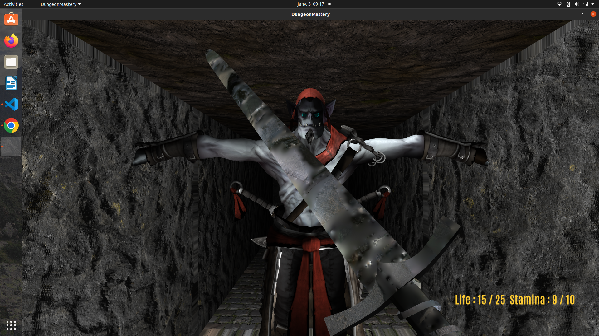
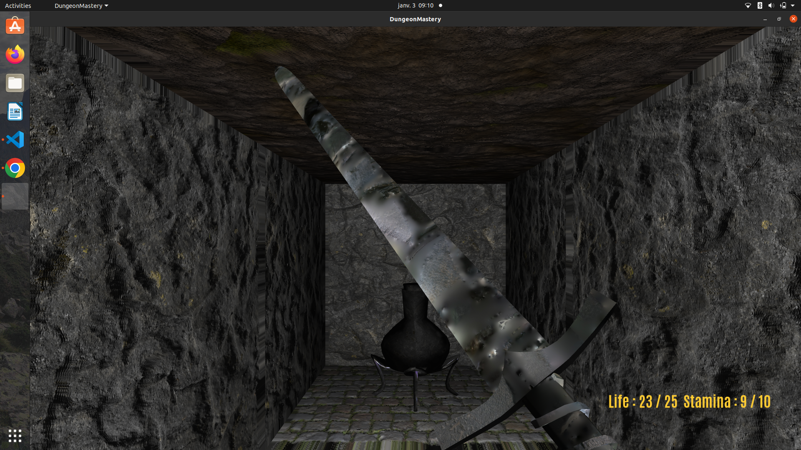
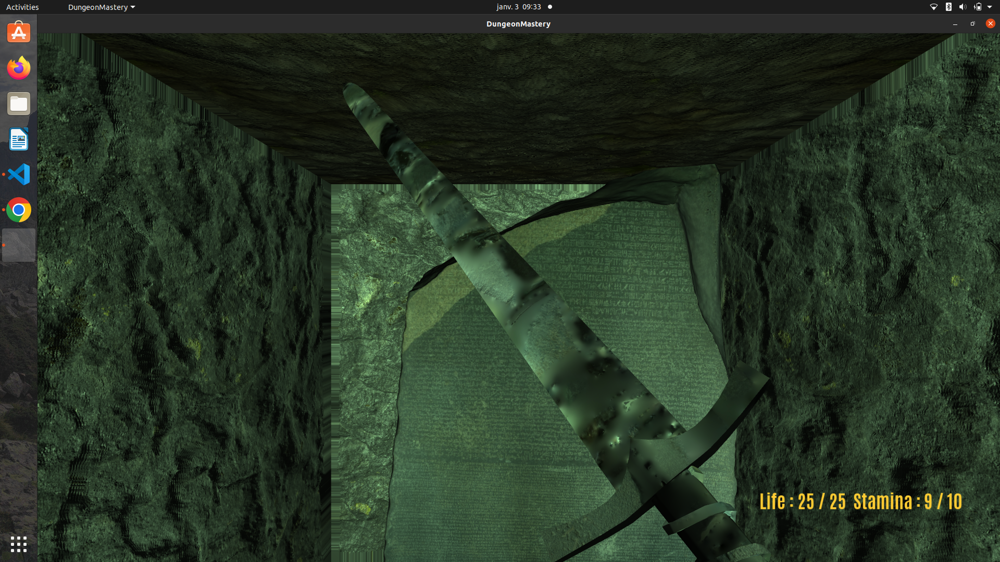
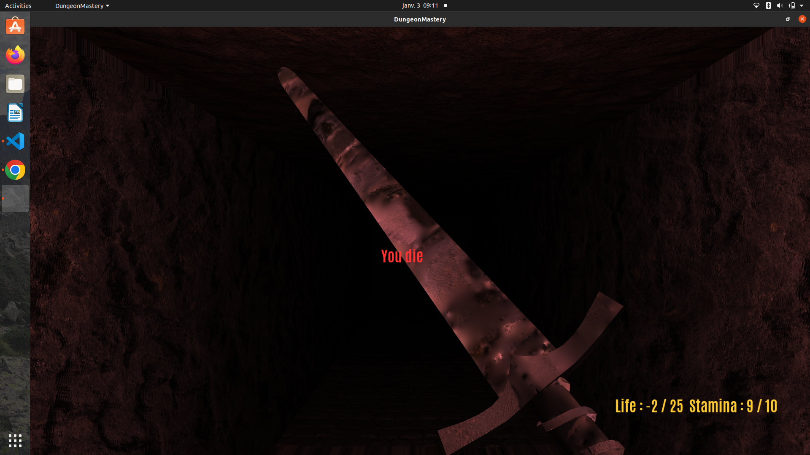
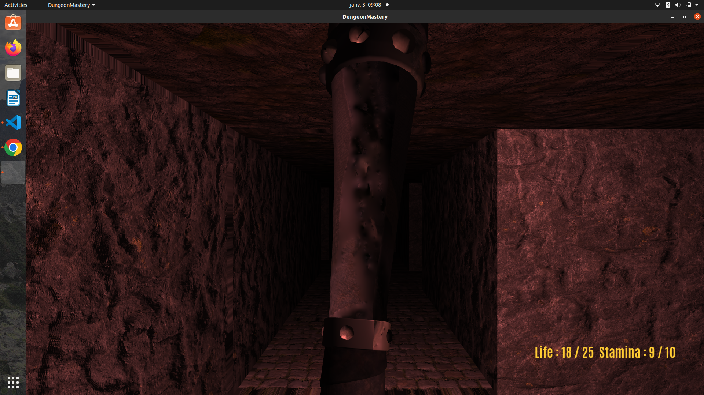

# OPEN_GL_3D_dungeon_mastery_game# 3D Game made in Opengl based on the game Dungeon Master



## How to Install

First of all for running the game you will need a recent Debian based distributions. You will also need a gcc recent compiler which can compile c++17 code or above. Personally I have used GCC 10.3 in my project and the vsCode IDE.

<br> 
Once you have this requirements fulfilled you will need to install few libraries.

<br>

### Loading dependencies
For loading models and adding sounds to our project we need to install assimp and audio-sfml. This can be done with the following:
<br>

```code
sudo apt install libassimp-dev libsfml-dev
```
Then you will need to clone all the submodules includes in the project:
<br>
```code
git clone https://github.com/glfw/glfw.git
```
```code
git clone https://github.com/nothings/stb.git
```
```code
git clone https://github.com/g-truc/glm.git
```
and place all the downloaded folders in the folder lib/.
<br>
Freetype and glad are already include in the repository inside the lib/ folder.
<br>
Once all of this is done you can run the following

```code
mkdir build
cd build
cmake ..
make
```

<br>
Be careful to run your program from the build directory since all the assets aren't loaded from absolute path.  As for the CMake file, it should be put in the root directory.

## Rule of the Game

As you journey through the winding, monster-infested halls of the maze, you must use all of your courage and bravery to search for the hidden stone with hieroglyphs. This ancient artifact holds the key to unlocking the exit and leading you to freedom. But beware, for danger lurks at every turn, from scorching lava pits to beasts waiting to pounce. 

### In Details

Your hero starts with 25 points of health and 10 points of stamina, as well as two weapons - a cudgel and a sword.

| Weapons | Damage | Stamina Needed | Who use it? |
|:---------:|:-----------:|:---------:|:-----------:|
| `Sword` | 3 | 3 | hero |
| `Cudgel` | 5 | 6 | hero & monster |

The hero regains endurance points at a rate of 10 points per second and with 10 as a maximum, which allow him to hit more with the sword than with the cudgel but with less damage inflicted each time. As for monsters they can only beat the hero every each seconds with the cudgel.

The only way for the hero to regain health points is to visit locations in the maze that have health potions. A health potion location can only be visited once in all the game by the hero, monsters can't visit health locations.
The hero's vision decreases as his health points decrease (he see less and less far).

### Game command

| Command | Description |
|:---------:|:-----------:|
| `Right Click Mouse` | Change Weapon (Switching from Cudgel to Sword or vice-versa) |
| `Left Click Mouse` | Attack Monster |
| `Z` | Move Forward |
| `D` | Turn camera Right by 90° |
| `S` | Turn camera in the opposite direction (by 180°) |
| `Q` | Turn camera Left by 90° |
| `ESC` | Exit Game |

### Assets 

All the models are free to use and has been downloaded from https://sketchfab.com, as for the texture they are from https://3dtextures.me. 
<br>
We use five different models:
    <br>
    -> 2 for the weapons (Cudgel,Sword)
    <br>
    -> 1 for the monster
    <br>
    -> 1 for the life potion
    <br>
    -> 1 for the stone with hieroglyphs (model of the rosetta stone)

It depends on the models, but in general they use up to four different textures each (diffuse, normal, specular, emission). 
For a better experience, we also added sound effects (hitting with the sword/cudgel, drinking a life potion, walking on lava, and rolling stone sounds when opening the doors of the maze), as well as stressful music when a monster sees the hero.

### Map Format
The input map is in the form of a two-dimensional std::vector with the following value code:

| Value | Corresponding case |
|:---------:|:-----------:|
| `0` | Wall |
| `1` | Corridor |
| `2` | Hieroglyph Stone  |
| `3` | Monster initial position |
| `4` | Life potion |
| `5` | Lava |
| `-1` | Exit |

You will also need to specify in the map header the location of the exit and of the stone in the map coordinates (matrix index of row and columns).

You will also need to update the camera start position if you choose to change the coordinate of the start point.

### Graphics Details of Implementation & Visual Effects

The chosen lighting model is a Blinn-Phong model with its three components - ambient, diffuse, and specular. Most of the quads in the maze have three textures: a diffuse map, which is the main texture responsible for color and overall appearance; a depth map; and a normal map, which is used for parallax and normal mapping to give the textures a more realistic, 3D appearance. The implementation of the Normal mapping and parallax mapping follow the online tutorial of LearnOpenGl by Johey De Vries.

Models owns up to 4 textures (diffusion,specular,normal,emission).

For rendering the maze we render cubes for all the wall components (case with value <=0) and 2 quads for each case of the corridor (one for the ground and one for the roof).

As an optimisation we use Face Culling when rendering all the cube which composed the wall of the maze. 

We also change a litle bit the overall colors for the interaction with objects or events (red when hero is loosing life or die, blue when hero drink a life potion, green when he activate the stone).

We use 5 types of different shaders:
<br>
-> A basic shader which just use Blinn-Phong illumination (ambient,diffuse,specular) without other effects
<br>
-> A normal & parallax mapping shader for rendering all the textures of the maze.
<br>
-> As a little variation we use a lava shader which almost the same as the previous but use a lower attenuation (which allows the lava to be seen from further away)
<br>
-> A normal & specular & emission shader which is used to render the 3d models.
<br>
-> A text shader which only used to render text.

## Issues & Troubleshooting

There is often an error message when starting the application when the models are being downloaded. Because some of them are quite huge you can experienced an "application is not responding error" you just have to click wait and the application will start normally. 

### Bug(s)

Bugs still appear, particularly with monsters, they sometimes remain frozen. 


### Some screenshots


<br>
Life potion

<br>
The hero just open the exit by activating the stone.

<br>
endgame.

<br>
The hero cross lava.

